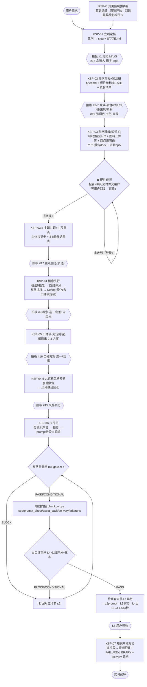
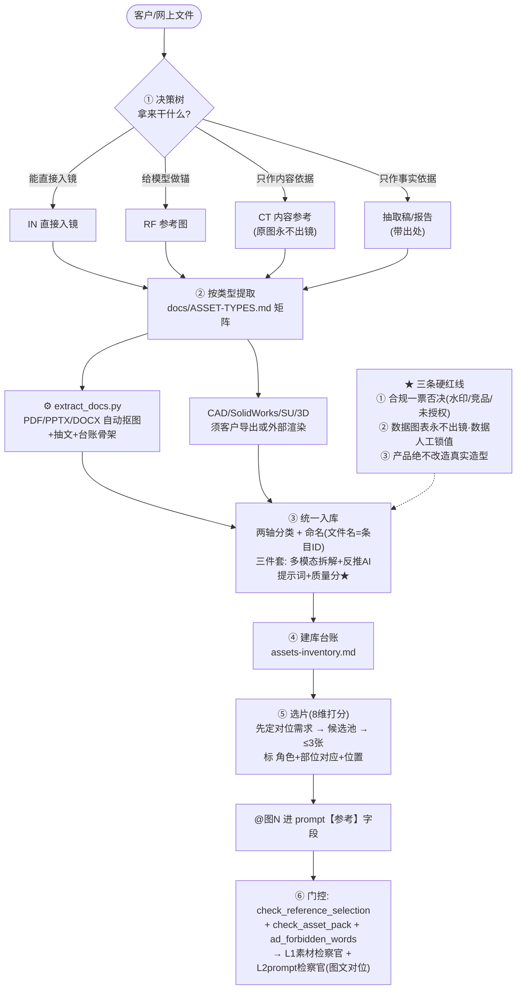

# 科生 SOP 流程图（SOP Flow）

> **用途**：把科生的两条主干流程画成图，作为 `docs/USER_SOP.md`（KSP 流程）与 `docs/ASSET-TYPES.md`（素材处理）的**可视化配套**。
> 图一 = **KSP 主流程**（立项 → 交付，含门控与拍板点）；图二 = **素材处理流程**（文件到手 → 参考图进 prompt）。
> 铁则（贯穿两图）：① **用户是甲方**，每关拍板 ② **拍板必用选项卡** ③ **证据先行** ④ **知识只进图谱**。

---

## 图一 · KSP 主流程（KSP-01 ~ KSP-07 + KSP-C）

```
┌──────────────────────────────────────────────────────────────────────────────┐
│ 四条铁则：① 用户是甲方(每关拍板) ② 拍板必用选项卡 ③ 证据先行 ④ 知识只进图谱    │
└──────────────────────────────────────────────────────────────────────────────┘

 [用户需求]
     │
     ▼
┌─ KSP-01 立项定档 ──────────────────────────── 制片人 ─┐
│  一句话理解 → 三问(做什么片/给谁看/多久要) → slug+STATE │
└──────────────┬────────────────────────────────────────┘
               │ ▲ 拍板 #1 定档(M/L/S)  #18 品牌名·用字·logo
               ▼
┌─ KSP-02 需求简报+预注册 ─────────── 制片人 + 观众代言人等 ─┐
│  brief.md + 预注册标准 3-5 条 + 素材清单/缺口              │
└──────────────┬────────────────────────────────────────────┘
               │ ▲ 拍板 #2-7 受众/平台/时长/风格/画风/素材  #19 强调色·主色·画风
               ▼
┌─ KSP-03 科学理解(知识关) ────── 科学顾问 + 受众 + 导演(并行) ─┐
│  7 步理解法(≥L2) + 调研图料三件套 + 两点讲明白                │
│  产出：scientist-理解报告.md + scientist-报告.docx + 讲解.pptx │
└──────────────┬──────────────────────────────────────────────┘
               ▼
      ╔═══════════════════════════════════════════════════╗
      ║ ⛔ 硬性停顿：报告 = 中间交付件，交用户完整阅读       ║
      ║    用户读完 → 明确回复「继续」（讨论记 m2-纪要.md）  ║
      ║    未收到「继续」→ 禁止推进下一步 / 禁止抛拍板选项   ║
      ╚═══════════════════════┬═══════════════════════════╝
               │ 「继续」
               ▼
┌─ KSP-03.5 主题共识 + 内容重点对齐 ─────────────────────┐
│  主体共识卡(一句话讲清主体) + 3-8 条候选重点 → 重点协议   │
└──────────────┬─────────────────────────────────────────┘
               │ ▲ 拍板 #17 内容重点圈选(多选)
               ▼
┌─ KSP-04 创意概念先行 ── 导演/编剧/摄影/观众代言人 ──────┐
│  ① Insight(已在 03.5)  ② Ideation: 各出 5 个概念        │
│  ③ Evaluation: 四维评分 + 红队挑战  ④ Presentation       │
│  ⑤ Refine: 只深化所选 → 完整方案(含口播稿定稿)           │
└──────────────┬─────────────────────────────────────────┘
               │ ▲ 拍板 #9 概念 选一 / 融合 / 自定义
               ▼
┌─ KSP-05 口播稿(先定内容) ─────────────────────── 编剧 ─┐
│  2-3 个口播方案(直白规格型 / 价值翻译型 / 混合型)         │
└──────────────┬─────────────────────────────────────────┘
               │ ▲ 拍板 #16 口播方案 选一 / 混搭
               ▼
┌─ KSP-04.5 九宫格风格预览(口播后) ──── 分镜师 + 美术指导 ─┐
│  九宫格出图 → 美术批复 → 风格基线固化(风格token/色板/画风) │
└──────────────┬─────────────────────────────────────────┘
               │ ▲ 拍板 #15 风格预览(按此基线 / 换方向 / 微调)

      ★ 顺序铁则：口播稿 → 九宫格出图 → 才做分镜
               │
               ▼
┌─ KSP-06 执行关(分镜/声音/prompt/剪辑) ──────────────────┐
│  分镜表 ‖ 声音方案 → 摄影方案 → prompt 分段并行 ‖ 剪辑预计划│
│  产出：storyboard-分镜表.md + m4-prompts/prompts-*.md     │
└──────────────┬──────────────────────────────────────────┘
               ▼
      ┌──────────────────────────────┐
      │ 红队前置闸 m4-gate-red        │──BLOCK──┐
      └──────────────┬───────────────┘         │
                     │ PASS/CONDITIONAL       │ 打回对应环节
                     ▼                        │ (≤2 循环)
      ┌──────────────────────────────┐         │
      │ 机器门控 check_all.py         │◄────────┘
      │ sop / prompt_sheet / asset_pack│
      │ delivery / ad_forbidden / runs │
      └──────────────┬───────────────┘
                     ▼
      ┌──────────────────────────────┐
      │ 出口评审闸 L4 (七维评分+三态)  │──BLOCK/CONDITIONAL──┐
      └──────────────┬───────────────┘                     │
                     │ PASS                                │ 打回(≤2)
                     ▼                                     │
      ┌──────────────────────────────┐                      │
      │ 检察官五层                    │◄─────────────────────┘
      │ L1 素材 · L2 prompt · L3 事实 │
      │ L4 出口 · L4.5 总检 → L5 签收 │   ← 每层独立上下文，只看证据
      └──────────────┬───────────────┘
                     ▼
┌─ KSP-07 知识萃取归档 ───────────────────────────────────┐
│  通用知识 → 域片段 → 重建图谱 + 失败教训 → FAILURE-LIBRARY │
│  交付包归档 delivery/{视频, 分镜, prompts, README}        │
└──────────────┬──────────────────────────────────────────┘
               ▼
          [交付闭环] ──► 下次开工前先读 FAILURE-LIBRARY（防重复踩坑）

 横切：KSP-C 变更控制（随时）— 变更记录 → 影响评估 → 回退最早受影响关卡
```



---

## 图二 · 素材处理流程（文件到手 → 参考图进 prompt）

> 依据：`docs/ASSET-TYPES.md`（类型矩阵）+ `playbooks/asset-library-flow.md`（五步闭环）+ `templates/assets-inventory.md`（台账）+ `templates/reference-selection.md`（选片）。
> **核心：类型差异只在"提取"一步；分类/命名/入库/选片全类型统一。**

```
客户/网上文件到手
（视频 / 图片 / 矢量 / PPT / PDF / Word / CAD / SolidWorks / SU / 3D / 字体 / 表格 / 音频）
     │
     ▼
┌─ ① 决策树（先问"拿来干什么"）───────────────────────────┐
│  能直接入镜?          → IN 直接入镜（信任主体，须真素材+授权）│
│  给模型做锚(外观/结构/场景/质感)? → RF 参考图              │
│  只作内容依据(数据/原理/图表)?    → CT 内容参考（原图永不出镜）│
│  只作事实/口径依据?              → 抽取稿/报告（带出处）    │
│  ★ 同一文件可多角色 → 拆开分头归类                        │
└──────────────┬───────────────────────────────────────────┘
               ▼
┌─ ② 按类型提取（docs/ASSET-TYPES.md 类型矩阵）────────────┐
│  视频    : 读中帧 → 抽帧建 RF_SCENE → 记画幅/帧率          │
│  图片    : 直接入库（read_image 看真图，不凭文件名）        │
│  矢量    : 光栅化 300dpi+ ＋ 保留矢量源 ＋ 官方取 HEX      │
│  PPT     : python-pptx 抠图 + 抽文(含表格/备注)            │
│  PDF     : PyMuPDF get_images + get_text（标页码）         │
│  Word    : python-docx 全文 + inline_shapes                │
│  CAD     : 须导出 PDF/SVG → 光栅化（不能直喂 AI）          │
│  SolidW. : 导三视图/等轴测 或 PhotoView 渲染（须 SW 环境）  │
│  SU      : 导场景图/等轴测（只作空间比例，不作外观锚）      │
│  3D 中性 : Blender/KeyShot 渲染三视图                      │
│  字体/表格/音频 : 查授权 / 提指标(AI不生成数字) / 听辨登记  │
│                                                            │
│  ⚙ 自动化: scripts/extract_docs.py（PDF/PPTX/DOCX 批量抠图  │
│     +抽文+台账骨架，去重+尺寸过滤；CAD/3D 须人工/外导）      │
└──────────────┬───────────────────────────────────────────┘
               ▼
┌─ ③ 统一入库（全类型同一套）─────────────────────────────┐
│  两轴分类: IN/RF/CT × MAIN/PART/SCENE/TEXT/STR/DATA/BRAND/RAW│
│  命名: <用途>_<类型>_<主体>_<视角>_<序号>（文件名=条目ID）  │
│  三件套: read_image 多模态拆解 + 反推AI合成提示词 + 质量分★ │
│  （脚本脚手架: classify_assets.py / annotate_assets.py）    │
└──────────────┬───────────────────────────────────────────┘
               ▼
┌─ ④ 建库台账 assets-inventory.md ───────────────────────┐
│  条目ID/用途/类型/主体/视角/内容标签/反推prompt/★/来源·授权│
└──────────────┬───────────────────────────────────────────┘
               ▼
┌─ ⑤ 参考图使用（选片）templates/reference-selection.md ───┐
│  先定"对位需求" → 候选池(内容标签/反推prompt 文字匹配+高分) │
│  → 8 维打分 → 入选 ≤3 张 → 标"角色＋部位对应＋位置＋依据句" │
│  → @图N 进 prompt【参考】字段                              │
└──────────────┬───────────────────────────────────────────┘
               ▼
┌─ ⑥ 门控与检察官 ────────────────────────────────────────┐
│  check_reference_selection.py（选片）                      │
│  check_asset_pack.py（引用可解析/无后补提示词=自包含）      │
│  ad_forbidden_words.py（合规禁词）                         │
│  → L1 素材检察官 + L2 prompt 检察官（图文对位硬查）          │
└────────────────────────────────────────────────────────────┘

 ★ 三条硬红线：① 合规一票否决（水印/竞品/团队照/未授权不入库）
                ② 数据图表只作 CT，永不出镜；数据一律人工锁值
                ③ 产品/设备类：绝不改造真实造型＝@参考图不变
```



---

## 附一 · 你在哪 7 个地方做决定（速查）

| # | 拍板点 | 关卡 |
|---|---|---|
| 1 | **定档** M/L/S | KSP-01 |
| 2 | **简报+品牌用字+风格/画风** | KSP-02 |
| 3 | **内容重点圈选**（多选） | KSP-03.5 |
| 4 | **概念拍板**（选一/融合） | KSP-04 |
| 5 | **口播方案**（选一/混搭） | KSP-05 |
| 6 | **九宫格风格预览** | KSP-04.5 |
| 7 | **验收签收** | KSP-06/出口 |

**其余按需触发**：#8 事实争议/待确认 · #10 超范围/品味取舍 · #11 CONDITIONAL · #12 BLOCK · #13 术语发音 · #14 时长超限 · #18 品牌名/用字/logo · #19 风格基线全局视觉决策（强调色/主色/画风）

> 完整预置选项见 `templates/user-gate.md`。

---

## 附二 · 门控脚本对照表

| 环节 | 脚本 | 拦什么 |
|---|---|---|
| **一键总检** | `check_all.py` | 下面 7 项一次跑完 |
| 产物存在性 | `check_sop.py` | 跳 SOP / 缺产物 + 每镜 prompt 字段不全 |
| prompt 规范 | `check_prompt_sheet.py` | 核心字段缺 / 口播并入画面 / 口播≠口播稿 / 风格不一致 / 参考漏挂 / 负面空 |
| 素材自包含 | `check_asset_pack.py` | @引用未登记 / "待补充·拍照"后补提示词 |
| **交付件收敛** | `check_delivery.py` | 多源并存 / 交付包死链 / 口播稿多版本漂移 |
| 广告合规 | `ad_forbidden_words.py` | 绝对化·极限词 / 疗效承诺 / 平台禁语 |
| runs 纯净 | `check_runs_clean.py` | runs/ 混入非项目散落物 |
| **文档完整性** | `check_docs_integrity.py` | **技能级**：SOP 断链 / 孤岛（写了没人读）/ 启动必读与门控脚本不一致 |
| 选片校验 | `check_reference_selection.py` | 选片要素不完整（角色/部位/位置） |
| 残留扫描 | `check_residual.py` | 旧表述/禁词残留全文回归 |
| 素材提取 | `extract_docs.py` | （工具）PDF/PPTX/DOCX → 抠图+抽文+台账骨架 |
| 素材分类/入库 | `classify_assets.py` / `annotate_assets.py` | （工具）分类命名 / 三件套脚手架 |
| 报告转档 | `md_to_docx.py` / `build_science_report.py` | （工具）Markdown → **适配 Word** 的 docx（封面/目录/页眉页脚/中文字体/真表格）；报告→md+docx+PPT大纲 |

---

## 附三 · 里程碑 × 主要角色 × 产物

| 里程碑 | 主要角色（并行） | 关键产物 |
|---|---|---|
| M1 简报 | 制片人 + 观众代言人 + 科学/导演/摄影约束 | `brief.md`（含预注册标准+定档+素材状态） |
| M2 科学理解 | 科学顾问 + 观众代言人 + 导演 | `scientist-理解报告.md`（**Word适配**）`scientist-报告.docx` + `scientist-讲解-大纲.md` + `scientist-讲解.pptx`/deck + `assets-inventory.md` + `m2-纪要.md` |
| M3 方案 | 导演 + 编剧 + 摄影 + 分镜师（+红队） | `concepts/` + `m3-scoring.md` + `m3-proposal.md`（含口播稿定稿） + `m4.5-风格基线-九宫格spec.md` + `style-baseline-固化.md` |
| M4 执行 | 编剧 + 分镜师 + 声音 + 摄影 + prompt×N + 剪辑 | `screenwriter-口播稿-定稿vN.md` + `storyboard-分镜表.md` + `sound-声音方案.md` + `dop-摄影方案.md` + `m4-prompts/prompts-*.md` + `editor-剪辑预计划.md` |
| M5 交付 | 红队 + 检察官五层 + 用户 | `m4-gate-red.md` + `m5-出口-评审单.md` + `delivery/`（视频/分镜/prompts/README/授权） |
| KSP-07 | 科学顾问 + 制片人 | 图谱域片段 + `FAILURE-LIBRARY.md` 追加 + 交付包归档 |

---

## 关联文件

- 流程权威：`docs/USER_SOP.md`（KSP-01~07 + KSP-C）
- 素材类型：`docs/ASSET-TYPES.md`（13 类文件固定处理方案）
- 素材流程：`playbooks/asset-library-flow.md` · `playbooks/production-workflow.md`
- **PPT/Deck 流程**：`playbooks/ppt-deck-flow.md`（配合 `ppt-master` / `huashu-design`）
- 质量门控：`protocols/quality-gate.md`（七维+禁区+检察官五层）
- 拍板速查：`templates/user-gate.md`
- 编排手册：`orchestration/ORCHESTRATION.md`
- 失败教训：`knowledge/FAILURE-LIBRARY.md`
