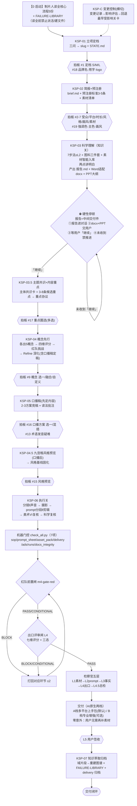
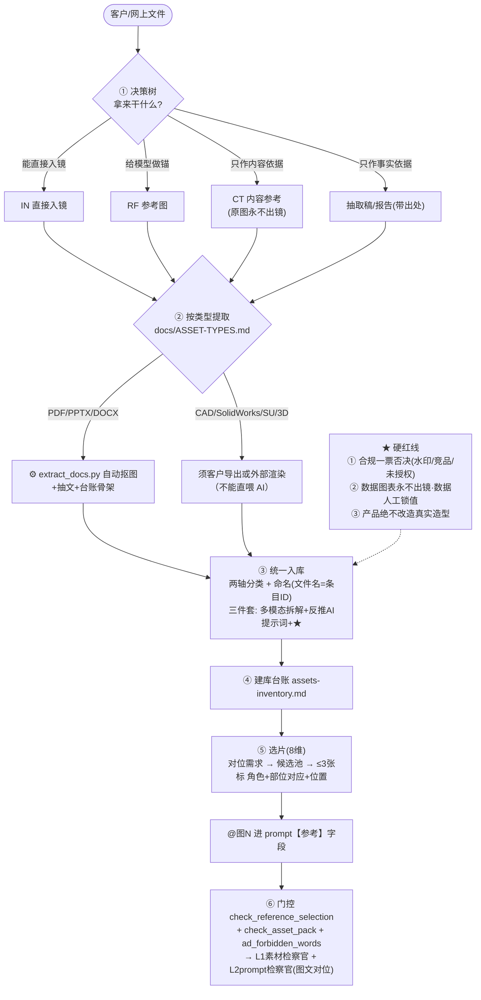

# 科生 SOP 流程图（SOP Flow · 完整版）

> **用途**：科生全流程的可视化总图。权威文字规范是 `docs/USER_SOP.md`（KSP-01~07 + KSP-C）；
> 本文件是它的**图示配套**，另含素材处理（`docs/ASSET-TYPES.md`）与 PPT/Deck（`playbooks/ppt-deck-flow.md`）。
>
> **四条铁则（贯穿全图）**：① **用户是甲方**——每关拍板才推进 ② **拍板必用选项卡**（`ask_user_question`，≥2 选项、推荐置顶、留"自定义"兜底）
> ③ **证据先行**——基于文件拍板必须先展示依据（全文/要点/路径+描述/来源）再给选项，禁盲选 ④ **知识只进图谱**——调研知识→域片段→重建图谱，不新建概念卡。

---

## 总览：一页看懂

```
启动(读全核心流程5份+失败图书馆)
   → KSP-01 立项定档 → KSP-02 简报+预注册
   → KSP-03 科学理解 ⛔硬性停顿(等「继续」) → KSP-03.5 主题共识+重点
   → KSP-04 概念先行 → KSP-05 口播稿 → KSP-04.5 九宫格风格
   → KSP-06 执行(分镜/声音/prompt/剪辑) →[门控+红队双闸+检察官五层]→ 交付签收
   → KSP-07 知识萃取归档 → 闭环
   横切：KSP-C 变更控制     降级：S 档单干 / subagent 失败重派
```

---

## 图一 · KSP 主流程（KSP-01 ~ KSP-07 + KSP-C）

```
┌──────────────────────────────────────────────────────────────────────────────┐
│ 四条铁则：① 用户是甲方(每关拍板) ② 拍板必用选项卡 ③ 证据先行 ④ 知识只进图谱    │
└──────────────────────────────────────────────────────────────────────────────┘

【0 启动】制片人（主 agent）先读全「核心流程全集」5 份 + 失败图书馆，再干任何活
   docs/USER_SOP.md · orchestration/ORCHESTRATION.md · protocols/quality-gate.md
   playbooks/production-workflow.md · templates/user-gate.md  ＋ knowledge/FAILURE-LIBRARY.md
   ▶ 读全前禁止派活/建文件；产物只落 runs/<项目slug>/
     │
     ▼
┌─ KSP-01 立项定档 ─────────────────────────────── 制片人 ─┐
│  一句话理解 → 三问(做什么片/给谁看/多久要) → slug + STATE.md │
│  定档：S 单干 / M 并行+双闸(默认) / L 全会+全自动           │
└──────────────┬──────────────────────────────────────────┘
               │ ▲ 拍板 #1 定档   #18 品牌名·用字·logo
               ▼
┌─ KSP-02 需求简报 + 预注册 ──── 制片人 + 并行4约束(科学/导演/摄影/受众) ─┐
│  brief.md = 简报 + 预注册标准 3-5 条 + 素材清单/缺口                   │
│  铁则：信息缺口必须问清，不许猜                                         │
└──────────────┬───────────────────────────────────────────────────────┘
               │ ▲ 拍板 #2-7 受众/平台/时长/风格/画风/素材缺口   #19 强调色·主色·画风
               ▼
┌─ KSP-03 科学理解（知识关 · 先读后谈）─── 科学顾问 + 观众代言人 + 导演(并行) ─┐
│  · 7 步深度理解法 → 理解深度 ≥L2（L1 只够新闻稿，禁止创作）                  │
│  · 调研图料三件套：①科学道理(→报告/图谱) ②网图(→refs/，标来源，不入镜)      │
│                    ③素材图(客户全量收集 → 分类命名建库)                    │
│  · 素材智能入库（M2 同步·必做）：每张三件套=read_image 多模态拆解 +          │
│    反推 AI 合成提示词(文字检索键) + 质量分 ★(合规一票否决)  ← 图二           │
│  · 两点讲明白：产品=介绍+卖点｜机构=研究什么+人员组成                       │
│                设施=能力+存在意义｜科普=先把人讲明白                        │
│  产物：scientist-理解报告.md（结构化·唯一事实源）                           │
│        scientist-报告.docx（**适配 Word**：封面/目录/页眉页脚页码/中文字体/真表格）│
│        scientist-讲解-大纲.md（→ 图三 PPT）                                 │
│  ⚙ scripts/build_science_report.py ／ scripts/md_to_docx.py                │
└──────────────┬─────────────────────────────────────────────────────────────┘
               ▼
   ╔═══════════════════ ⛔ 硬性停顿：报告 = 中间交付件 ═══════════════════╗
   ║  ① 完整报告全文写进对话（不得压缩成 3 行总结）                        ║
   ║  ② docx + PPT 作为文件交用户（可打开/可上图/可直接用）                ║
   ║  ③ 用户读完 → 明确回复「继续」（讨论/纠偏记 m2-纪要.md）              ║
   ║  ④ 未收到「继续」→ 禁止推进任何后续环节 / 禁止抛拍板选项              ║
   ╚═══════════════════════════════┬════════════════════════════════════╝
               │ 「继续」
               ▼
┌─ KSP-03.5 主题共识 + 内容重点对齐 ───── 制片人 + 导演 + 观众代言人 ─┐
│  ① 主体共识卡（一句话讲清这条片子讲什么/为谁讲）                    │
│  ② 3-8 条候选重点（信息点+支持证据+对应镜头可能）                   │
│  ③ 讨论 → 落成「内容重点协议」（重点×权重 P0/P1/弱化/删除×镜头预算）│
└──────────────┬───────────────────────────────────────────────────┘
               │ ▲ 拍板 #17 内容重点圈选（多选）
               ▼
┌─ KSP-04 创意概念先行 ──── 导演 / 编剧 / 摄影指导 / 观众代言人 ─────┐
│  Insight(已在 03.5) → Ideation(各出 5 个创意概念·非完整方案)        │
│  → Evaluation(四维打分：预注册/传播力/科学准确/可执行 + 红队挑战)   │
│  → Presentation(概念卡并列·**证据先行**)                            │
│  → Refine(只深化所选 → 完整方案：定位/受众/**口播稿定稿**/分镜概览) │
└──────────────┬───────────────────────────────────────────────────┘
               │ ▲ 拍板 #9 概念：选一 / 融合 / 自定义
               ▼
┌─ KSP-05 口播稿（先定内容）────────────────────────── 编剧 ─┐
│  2-3 个方案竞稿（①直白规格型 ②价值翻译型 ③混合型）+ 读法批注  │
│  逐句对号 `templates/narration-formula.md`（14 个句子公式）    │
└──────────────┬───────────────────────────────────────────┘
               │ ▲ 拍板 #16 口播方案：选一 / 混搭    ▲ #13 术语发音疑难→注音
               ▼
┌─ KSP-04.5 九宫格风格预览（口播后）──── 分镜师 + 美术指导 ─┐
│  九宫格出图 → 美术批复 → **风格基线固化**（风格token/色板/画风/构图）│
└──────────────┬───────────────────────────────────────────┘
               │ ▲ 拍板 #15 风格预览：按此基线 / 换方向 / 微调
               │
               ★ 顺序铁则：口播稿 → 九宫格出图 → 才做分镜
               ▼
┌─ KSP-06 执行关（并行 → 串行交接）───────────────────────────────────┐
│  分镜表(分镜师) ‖ 声音方案(声音设计师)                              │
│      ↓                                                             │
│  摄影方案(摄影指导：每镜运镜≤2+变速/光影/拍法路线/参考资产)          │
│      ↓                                                             │
│  prompt 分段并行转写(prompt工程师×N·每段5-8镜) ‖ 剪辑预计划(剪辑师)   │
│      ↓                                                             │
│  美术 VI 复核 → 科学复核(L3 事实检察官)                             │
│  产物：storyboard-分镜表.md / m4-prompts/prompts-<平台>.md          │
│        sound-声音方案.md / dop-摄影方案.md / editor-剪辑预计划.md    │
└──────────────┬─────────────────────────────────────────────────────┘
               ▼
┌─────────────── 门控层（机器 + 人工双轨）───────────────────────────┐
│  机器门控：python -X utf8 scripts/check_all.py runs/<slug>  （7 项）│
│   ① check_sop           产物齐 + 每镜 prompt 字段完整（缺=跳SOP→回退）│
│   ② check_prompt_sheet  核心字段/口播单独且与口播稿一致/风格token一致/参考@/负面非空│
│   ③ check_asset_pack     素材自包含（引用可解析、无"待补充/拍照"）    │
│   ④ check_delivery       交付件版本收敛（单一执行源/包自包含/无漂移）  │
│   ⑤ ad_forbidden_words   广告禁用词（绝对化/极限/疗效/平台禁语）      │
│   ⑥ check_runs_clean     runs/ 只放项目                             │
│   ⑦ check_docs_integrity 技能级：SOP 无断链/无孤岛                   │
│  其他：check_reference_selection(选片) / check_residual(残留回归)    │
└──────────────┬─────────────────────────────────────────────────────┘
               ▼
      ┌───────────────────────────────┐
      │ 红队前置闸 m4-gate-red         │──BLOCK──┐
      │ （独立上下文·未参与创作）        │         │
      └──────────────┬────────────────┘         │  打回对应环节
                     │ PASS / CONDITIONAL       │  （≤2 循环）
                     ▼                          │
      ┌───────────────────────────────┐         │
      │ 出口评审闸 L4（七维评分+三态）   │──BLOCK/CONDITIONAL──┐
      │ PASS / CONDITIONAL / BLOCK    │                     │
      └──────────────┬────────────────┘                     │
                     │ PASS                                │
                     ▼                                     │
      ┌───────────────────────────────┐                     │
      │ 检察官五层（每层独立上下文，     │◄────────────────────┘
      │ 只看证据、不听辩护、不代修）      │      ▲ #11 CONDITIONAL 修改后重交
      │ L1 素材 → L2 prompt → L3 事实   │      ▲ #12 BLOCK 打回重做
      │ → L4 出口 → L4.5 总检 → L5 签收 │
      └──────────────┬────────────────┘
                     ▼
┌─ 交付（AI 原生两档）───────────────────────────────────────────────┐
│  A 档·多平台上手包（默认）：每镜【平台对照 prompt + 参考图包 + 口播 + │
│     抽卡建议 + 画布操作步骤】；配音=AI 原生(TTS/剪映，口播带读法批注) │
│  B 档·专业增强（可选，用户主动要求时）                              │
│  **零意外铁则**：交付后用户绝不需要再拍照/找物/补素材 = 流程事故      │
│  ▲ #14 时长/预算超限：砍镜头 / 延长时间 / 减节奏                     │
└──────────────┬───────────────────────────────────────────────────┘
               ▼
┌─ KSP-07 知识萃取归档（闭环）───────────────────────────────────────┐
│  · 通用知识 → 域片段 → python -X utf8 scripts/build_union_kg.py 重建 │
│  · 失败教训 → knowledge/FAILURE-LIBRARY.md 追加（现象/根因/已固化/证据）│
│  · 交付包归档 delivery/（视频/分镜/prompts/README/授权）             │
│  · 隐私：kb/隐私红线.md 三分法，项目专有信息零入库                    │
└──────────────┬───────────────────────────────────────────────────┘
               ▼
        [交付闭环] ──► 下次开工前先读 FAILURE-LIBRARY（防重复踩坑）

 横切 KSP-C 变更控制（随时）：变更记录 → 影响评估(影响哪些 KSP) → 用户拍板 → 回退最早受影响关卡
 降级：S 档单干(明示"降级模式") ／ subagent 失败 → 同任务重派 1 次 → 仍失败制片人接手(注明降级)
```



---

## 图二 · 素材处理流程（文件到手 → 参考图进 prompt）

> 依据：`docs/ASSET-TYPES.md`（13 类文件固定处理方案）+ `playbooks/asset-library-flow.md`（五步闭环）+ `templates/assets-inventory.md`（台账）+ `templates/reference-selection.md`（选片）。
> **核心：类型差异只在"提取"这一步；分类/命名/入库/选片全类型统一。**

```
客户/网上文件到手
（视频 / 图片 / 矢量 / PPT / PDF / Word / CAD / SolidWorks / SketchUp / 3D / 字体 / 表格 / 音频）
     │
     ▼
┌─ ① 决策树（先问"拿来干什么"）────────────────────────────────┐
│  能直接入镜?                    → IN 直接入镜（信任主体，须真素材+授权）│
│  给模型做锚(外观/结构/场景/质感)? → RF 参考图                        │
│  只作内容依据(数据/原理/图表)?    → CT 内容参考（**原图永不出镜**）    │
│  只作事实/口径依据?              → 抽取稿/报告（带出处）              │
│  ★ 同一文件可同时多角色 → 拆开分头归类                              │
└──────────────┬───────────────────────────────────────────────┘
               ▼
┌─ ② 按类型提取（docs/ASSET-TYPES.md 类型矩阵）──────────────────┐
│  视频     : 读中帧 → 抽帧建 RF_SCENE → 记画幅/帧率                 │
│  图片     : read_image 看真图（不凭文件名判断）                     │
│  矢量     : 光栅化 300dpi+ ＋ 保留矢量源 ＋ 官方取 HEX 色值        │
│  PPT      : python-pptx 抠图 + 抽文（含表格/演讲备注）             │
│  PDF      : PyMuPDF get_images + get_text（标页码出处）            │
│  Word     : python-docx 全文 + inline_shapes                      │
│  CAD      : 须导出 PDF/SVG → 光栅化（**不能直喂 AI**）             │
│  SolidW.  : 导三视图/等轴测 或 PhotoView 渲染（须 SW 环境·多在客户侧）│
│  SketchUp : 导场景图/等轴测（只作空间比例，**不作外观锚**）         │
│  3D 中性   : Blender/KeyShot 渲染三视图                            │
│  字体/表格/音频 : 查商用授权 / 提指标(AI不生成数字) / 听辨登记      │
│  ⚙ 自动化：scripts/extract_docs.py（PDF/PPTX/DOCX 批量抠图+抽文+    │
│     台账骨架；内容哈希去重 + 最小边长过滤）                         │
│  ⚠ CAD/3D 无解析库 → 走"向客户要导出件"，作素材缺口走拍板 #7        │
└──────────────┬───────────────────────────────────────────────┘
               ▼
┌─ ③ 统一入库（全类型同一套）──────────────────────────────────┐
│  两轴分类：IN/RF/CT × MAIN/PART/SCENE/TEXT/STR/DATA/BRAND/RAW     │
│  命名：<用途>_<类型>_<主体>_<视角>_<序号>（**文件名=条目ID**）      │
│  三件套：read_image 多模态拆解(物品/任务/场景/结构/质感/数据/品牌/实拍)│
│          + 反推 AI 合成提示词(文字检索键) + 质量分 ★1-5            │
│  ⚙ scripts/classify_assets.py ／ scripts/annotate_assets.py       │
└──────────────┬───────────────────────────────────────────────┘
               ▼
┌─ ④ 建库台账 assets-inventory.md ─────────────────────────────┐
│  条目ID/用途/类型/主体/视角/内容标签/反推prompt/★/来源·授权      │
└──────────────┬───────────────────────────────────────────────┘
               ▼
┌─ ⑤ 参考图使用（选片 · templates/reference-selection.md）──────┐
│  先定"对位需求" → 候选池(按内容标签/反推prompt 文字匹配+高分优先)  │
│  → 8 维打分(对位度/信息完整/角度/光影/占位/合规/唯一性/可溯源)     │
│  → 入选 ≤3 张 → 标"角色＋部位对应＋位置＋依据口播哪句"            │
│  → @图N 进 prompt【参考】字段                                    │
└──────────────┬───────────────────────────────────────────────┘
               ▼
┌─ ⑥ 门控 ───────────────────────────────────────────────────┐
│  check_reference_selection.py（选片要素完整）                  │
│  check_asset_pack.py（引用可解析 / 无后补提示词 = 自包含）       │
│  ad_forbidden_words.py（合规禁词）                            │
│  → L1 素材检察官 + L2 prompt 检察官（**图文对位硬查**）          │
└────────────────────────────────────────────────────────────┘

 ★ 三条硬红线：① **合规一票否决**（水印/竞品/团队照/未授权 → 不入库）
                ② **数据图表只作 CT，永不出镜**；数据一律**人工锁值**（AI 不生成数字）
                ③ 产品/设备类：**绝不改造真实造型**＝"保持真实造型=@参考图不变"
```



---

## 图三 · PPT / Deck 流程（配合外部技能）

> 依据：`playbooks/ppt-deck-flow.md`。**科生不自己拼 PPT**——出"大纲+资产"，交成熟技能出视觉，再按质量门验收。

```
① 内容就绪（科生）
   scientist-讲解-大纲.md（页序/要点/配图指向/出处）
   + assets-inventory.md 条目（图二产物）
   + 品牌资产：拍板 #18 品牌名·用字·logo ＋ #19 强调色/主色/画风（**官方源取色，禁自造**）
        │
        ▼
② 选技能（拍板）
   要"能改稿/交客户" → **ppt-master**（原生可编辑 .pptx）
   要"好看/路演级"   → **huashu-design**（高保真 HTML deck，可导 PDF/可编辑 PPTX）
   （重要场合可两者都出，让用户对比选）
        │
        ▼
③ 技能按自己的门走（**科生不得替它开闸**）
   ppt-master：读 workflows/routing.md 选**恰好一条**路由
               （generate-pptx / Quick / image-to-pptx / beautify / create-template /
                 fill-native / enhance）
               ⛔ BLOCKING 门 → **停下等用户确认**
               Image-first：进入规划前必须 web_search 搜 ≥2 组真实图（**禁"无图也行"**）
   huashu-design：🔴 **三方向硬门**——任何新视觉设计先出 **3 个差异化方向真实初稿**
                （多页 deck = 每方向 2 页代表页）让用户选；**指定风格也不豁免**
                Gate 文件必落档：brand-spec.md ＋ direction-approved.md（含**用户选择原话**）
                反 AI slop：紫渐变/emoji 图标/圆角卡片+左border/SVG画人脸 等禁区
        │
        ▼
④ 生成
   ppt-master   → .pptx（文字可在 PowerPoint 里直接改）
   huashu-design → HTML deck → 导 PDF / 可编辑 PPTX
        │
        ▼
⑤ 科生验收（protocols/quality-gate.md）
   七维评分 ＋ 视觉克制/反 AI 感（科生禁区：霓虹/镀铬反光/大光球/激光束/白底紫渐变/海军金）
   ＋ 图文对位(R12) ＋ 数据页**人工锁值**核验 ＋ 配图**授权核验**
        │
        ▼
⑥ 交付：.pptx / PDF 归档 delivery/，品牌资产与出处留档

 ★ 衔接铁则：**外部技能的门 = 科生的拍板点**，一律用 `ask_user_question` 选项卡执行；
   huashu 三方向选择的**用户原话**记进 direction-approved.md（满足其 gate 要求）；
   `build_science_report.py` 直出的 pptx **只是兜底，不作交付标准**。
```

---

## 附一 · 全部拍板点（19 个）

| # | 拍板点 | 关卡 | 预置选项（推荐置顶） |
|---|---|---|---|
| 1 | **定档** | M1/KSP-01 | M 档标准(Rec) / L 档旗舰 / S 档轻量 |
| 2 | **受众模式** | KSP-01/02 | PUB 公众科普(Rec) / EXP 专家评审(直白规格) / GOV 政府领导 / STD 学生 / IND 产业客户 |
| 3 | **投放平台** | KSP-02 | 未定(Rec) / 即梦 / 可灵 / 海螺 / Vidu / Runway / LibTV / cgprism |
| 4 | **时长** | KSP-02 | 3-5 分钟(Rec) / 1-3 / 5-8 / 8-15 / 自定义 |
| 5 | **风格方向** | KSP-02 | 科技明亮风(Rec) / 冷蓝生物荧光 / 电影质感 / … |
| 6 | **画风** | KSP-02 | 写实摄影(Rec) / 3D 渲染写实 / 电影感 / 日系动画 / 国风水墨 / 扁平矢量 MG / 黏土定格 |
| 7 | **素材缺口** | KSP-02 | 上网找公开素材(Rec) / 用户提供 / AI 生成替代 / 删掉该内容 |
| 8 | **事实争议/待确认项** | M2-M4 | 用户提供材料(Rec) / 保守表述(标"待确认") / 删除 |
| 9 | **创意概念拍板** | KSP-04 | 概念A/B/C/D/E 选一 / 融合 / 自定义 |
| 10 | **超范围/品味取舍** | M3-M4 | 按团队建议(Rec) / 保持原样 / 换一种 |
| 11 | **出口闸 CONDITIONAL** | M5 | 按评审意见修改后重交(Rec) / 接受现状 / 自定义 |
| 12 | **出口闸 BLOCK** | M5 | 打回对应环节重做(Rec，≤2 循环) / 用户拍板取舍 / 冻结 |
| 13 | **术语发音疑难** | M4-M5 | 同义词替换(Rec) / 保留并在配音稿标注读音 |
| 14 | **时长/预算超限** | M5 | 砍镜头(Rec) / 延长时间 / 减节奏内容 |
| 15 | **九宫格风格预览** | KSP-04.5 | 按此风格基线执行(Rec) / 换风格方向重出 / 微调某几格 |
| 16 | **口播方案选择** | KSP-05 | 方案A 直白规格型 / 方案B 价值翻译型 / 方案C 混合型 / 混搭 |
| 17 | **内容重点圈选（多选）** | KSP-03.5 | 从候选重点清单多选要加强的条目（可追加"我补充的重点"） |
| 18 | **品牌名/用字/logo** | KSP-01 简报 | 用官方已有素材(Rec，未定只用官方素材，不自行沿用) |
| 19 | **风格基线全局视觉决策**（强调色/主色/画风） | KSP-01/02 | 用户给定(Rec，写具体色/画风) |

> **用户侧速查（贴给用户）**：你在 **7 个必拍点**做决定——定档(01) · 简报+风格(02) · 内容重点圈选(03.5) · 概念拍板(04) · 口播方案(05) · 九宫格风格预览(04.5) · 验收(06)；其余（#8/#10-14/#18/#19）按需触发。
> 完整预置选项见 `templates/user-gate.md`。

---

## 附二 · 门控脚本对照表

| 环节 | 脚本 | 拦什么 |
|---|---|---|
| **一键总检** | `check_all.py` | 下面 8 项一次跑完 |
| 产物存在性 | `check_sop.py` | 跳 SOP / 缺产物 + 每镜 prompt 字段不全 |
| prompt 格式 | `check_prompt_sheet.py` | 核心字段缺 / 口播并入画面 / 口播≠口播稿 / 风格不一致 / 参考漏挂 / 负面空（**兼容 `**字段**：` 与 `【字段】` 两代格式**） |
| **prompt 十步 SOP** | `check_prompt_sop.py` | **十步执行证据**：参考图裸引用（只写 @图N 无角色/取哪→放哪）/ 风格token不同源 / 口播≠口播稿 / 时间轴无按秒分段 / 缺 README = **FAIL**；缺"部位对应·放哪位置"/产品镜缺"保真实造型"/参数缺项 = WARN |
| 素材自包含 | `check_asset_pack.py` | @引用未登记 / "待补充·拍照"后补提示词（兼容新旧引用语法） |
| **交付件收敛** | `check_delivery.py` | 多源并存 / 交付包死链 / 口播稿多版本漂移 |
| 广告合规 | `ad_forbidden_words.py` | 绝对化·极限词 / 疗效承诺 / 平台禁语 |
| runs 纯净 | `check_runs_clean.py` | runs/ 混入非项目散落物 |
| **文档完整性** | `check_docs_integrity.py` | **技能级**：SOP 断链 / 孤岛（写了没人读）/ 启动必读与门控脚本不一致 |
| 选片校验 | `check_reference_selection.py` | 选片要素不完整（角色/部位/位置） |
| 残留扫描 | `check_residual.py` | 旧表述/禁词残留全文回归 |
| 素材提取 | `extract_docs.py` | （工具）PDF/PPTX/DOCX → 抠图+抽文+台账骨架 |
| 素材分类/入库 | `classify_assets.py` / `annotate_assets.py` | （工具）分类命名 / 三件套脚手架 |
| 报告转档 | `md_to_docx.py` / `build_science_report.py` | （工具）Markdown → **适配 Word** 的 docx；报告→md+docx+PPT大纲 |

---

## 附三 · 检察官五层（每层独立上下文·只看证据·不听辩护·不代修）

| 层 | 检察官 | 查什么 | 产出 |
|---|---|---|---|
| **L1** | 素材检察官 | 零意外：素材包自包含（@引用全登记 / 无"待补充·拍照"提示） | `check_asset_pack.py` 输出 + 逐镜素材核对 |
| **L2** | prompt 检察官 | 交付格式（核心字段/口播单独且与口播稿一致/风格token一致/参考@/负面非空）＋ 禁词残留扫描 ＋ **图文对位硬查** ＋ 选片要素完整 ＋ 产品/设备公式合规 | `check_prompt_sheet.py` + `check_residual.py` + 逐文件细读 |
| **L3** | 事实检察官 | 科学准确：逐条核验（断言→证据(原文/截图/DOI)→判定→建议→推翻条件）；三态裁决 | `scientist-科学复核.md` + 数据引用清单 |
| **L4** | 出口检察官 | 质量总闸：七维评分单(0.0-1.0) + PASS/CONDITIONAL/BLOCK | `m5-出口-评审单.md` |
| **L4.5** | 总检察官 | 汇总 L1-L4 → **检查裁决书**（三态 + 各层评分 + 打回清单） | `检查裁决书.md` |
| **L5** | 用户签收 | 上手包 + 裁决书 + 全部工艺文件，缺一不可 | 签收 |

> 检察官卡：`agents/inspector.md`。发现问题**打回对应角色**，不代修。

---

## 附四 · 里程碑 × 主要角色 × 关键产物

| 里程碑 | 主要角色（并行） | 关键产物 |
|---|---|---|
| **M1 简报** | 制片人 + 观众代言人 + 科学/导演/摄影约束 | `brief.md`（预注册标准 + 定档 + 素材状态表）+ `STATE.md` |
| **M2 科学理解** | 科学顾问 + 观众代言人 + 导演 | `scientist-理解报告.md` + `scientist-报告.docx`（Word适配） + `scientist-讲解-大纲.md` + deck + `assets-inventory.md` + `m2-纪要.md` |
| **M3 方案** | 导演 + 编剧 + 摄影 + 分镜师 + 观众代言人（+红队） | `concepts/` + `m3-scoring.md` + `m3-proposal.md`（含口播稿定稿）+ 九宫格 spec + `style-baseline-固化.md` + `m2-纪要.md`/`decision-log.md` |
| **M4 执行** | 编剧 + 分镜师 + 声音 + 摄影 + prompt×N + 剪辑 | `screenwriter-口播稿-定稿vN.md` + `storyboard-分镜表.md` + `sound-声音方案.md` + `dop-摄影方案.md` + `m4-prompts/prompts-<平台>.md` + `editor-剪辑预计划.md` |
| **M5 交付** | 红队 + 检察官五层 + 用户 | `m4-gate-red.md` + `m5-出口-评审单.md` + `检查裁决书.md` + `delivery/`（视频/分镜/prompts/README/授权） |
| **KSP-07** | 科学顾问 + 制片人 | 图谱域片段（`packs/*-kg/kg.json` → 重建）+ `FAILURE-LIBRARY.md` 追加 + delivery 归档 |

---

## 附五 · 顺序铁则与硬规则（最容易踩的）

| # | 铁则 | 违反后果 |
|---|---|---|
| 1 | **读全核心流程再开工**（5 份 + 失败图书馆） | 漏规则、到处建文件 |
| 2 | **报告读完才推进**（KSP-03 硬性停顿，等「继续」） | 越过用户拍板 |
| 3 | **主题共识+重点对齐 → 才出方案**（KSP-03.5） | 方案跑偏、返工 |
| 4 | **口播稿 → 九宫格 → 才分镜**（顺序不可乱） | 风格与内容脱节、全片重改 |
| 5 | **口播稿在方案(M3)里就定稿**，不再出多份完整方案互相打架 | 版本混乱 |
| 6 | **交付件=单一自洽版本组合**（口播/分镜/prompt/风格基线各一份定稿） | 版本漂移 → CONDITIONAL |
| 7 | **零意外·素材自包含**（交付后用户不再补素材） | 流程事故（L1 FAIL） |
| 8 | **数据人工锁值**（AI 不生成数字）；未验证指标标"方案口径"或不入 | 科学红线 |
| 9 | **产品/设备类绝不改造真实造型**（@参考图不变） | 品牌/合规红线 |
| 10 | **每镜 prompt 带参考图挂载清单**（文件+取哪部分→放哪） | 画面与锚对不上 |
| 11 | **字幕=口播逐句同步**；文案白名单（零自创文案） | 用户明确否决过 |
| 12 | **知识只进图谱**（不新建概念卡） | 知识散落、查不到 |
| 13 | **runs/ 只放项目**（临时目录交付前删） | 目录污染 |
| 14 | **每关拍板用选项卡 + 证据先行** | 盲选 / 违规 |
| 15 | **机器门控报错先分"真缺"还是"格式别名误报"**（F-30：误报=修脚本不迁就） | 改制品迎合脚本 / 绕开门控 |

---

## 关联文件

- **流程权威**：`docs/USER_SOP.md`（KSP-01~07 + KSP-C）
- **素材类型**：`docs/ASSET-TYPES.md`（13 类文件固定处理方案）
- **素材流程**：`playbooks/asset-library-flow.md` · `playbooks/production-workflow.md`
- **PPT/Deck**：`playbooks/ppt-deck-flow.md`（配合 `ppt-master` / `huashu-design`）
- **报告交付**：`playbooks/science-report-flow.md` + `templates/science-report.md` + `templates/science-ppt.md`
- **质量门控**：`protocols/quality-gate.md`（七维 + 禁区 + 检察官五层）
- **拍板速查**：`templates/user-gate.md`
- **编排手册**：`orchestration/ORCHESTRATION.md`
- **失败教训**：`knowledge/FAILURE-LIBRARY.md`
